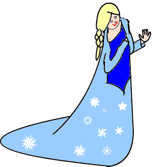
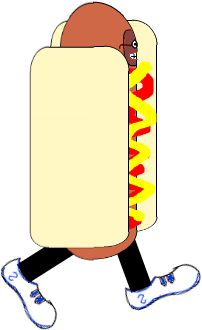
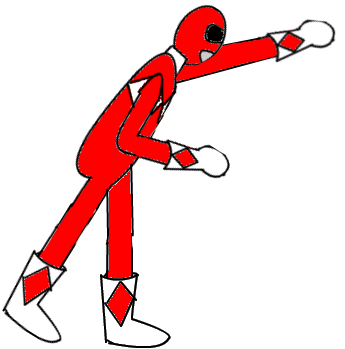

![Elder Strolls: Hallow's Eve][game logo]

This game was originally created for the University of Waterloo Games Institute Jam (Fall 2015)

![Fellowship of the Bus][logo]

## Installation
There are two recommended options for running this game.

1. Download one of the pre-built executable JAR files under [releases]. Run it by either double-clicking the JAR file or entering the command `java -jar <jar-name>` on the command line.
2. Build from source. The easiest way to do so is to use [sbt]:
    1. Install sbt.
    2. Run sbt from the command line in the project root directory.
    3. At the prompt, type `run`.

## Controls
This game can be controlled via keyboard or gamepad (compatible with both Playstation 3 and Xbox 360 controllers). The controls are given as follows (PS3/X360/Keyboard):

* Pause - Start/Start/P
* Return to main menu - Select/Back/Esc
* Punch - Cross/A/S
* Kick - Circle/B/S
* Dodge - Square/X/D
* Move - Left Stick/Left Stick/Arrow Keys

## How to Play
Elder Strolls: Hallow's Eve is a side-scrolling beat 'em up game taking place on Halloween. The main character, Herbert, is an elderly man who is sick of giving out candy to noisy, ungrateful kids on Halloween.

![Beat 'em up action][gameplay]

The main object of the game is to get those rotten kids off your lawn! To do so, you must defeat the boss enemy before losing all of your health. To reach the boss, you must first clear several waves of randomly generated enemies. Your current health is displayed as a bar at the top of the screen, along with your current score.

![Elder Strolls: Hallow's Eve][screenshot]

Each time you defeat an enemy, a pop-up appears below your health that describes some details about the enemy you defeated, including their name, age, and a fact about them.

![The fact box contains trivia on enemies][factbox]

This game supports multiplayer for up to 4 players using controllers. Each player character heals by 20% of their maximum HP at the start of each wave.

[![video image]][video]

### Playable Characters

The main character is Herbert, an elderly man who just wants some peace and quiet on Halloween.

Herbert has three actions:

1.  
 Punch deals 15 damage 

2.  
 Kick deals 40 damage 

3.  
 Dodge dashes to the side at double speed 

### Enemy Types

Enemies are spawned in waves from the left and right sides of the screen. Upon defeating an enemy, you receive their base score value multiplied by the current wave number. The various types of enemies in the game are:

1. 
 Ghost
    * Health: 100
    * Attack: 12
    * Speed: 4
    * Points: 1
    * Attacks with a wind-up kick
1. 
 Elsa
    * Health: 15
    * Attack: 4
    * Speed: 3
    * Points: 1
    * Range: 400
    * Attacks with a snowflake projectile
1. 
 Hotdog
    * Health: 60
    * Attack: 5
    * Speed: 4
    * Points: 2
    * Attacks by throwing ketchup bottles
1. 
 Power Ranger
    * Health: 150
    * Attack: 5
    * Speed: 3
    * Points: 3
    * Attacks with a fast punch
    * Can appear in 6 varieties: Red, Black, Blue, Pink, Yellow, and Green
1. 
 Horse Mask
    * Any common enemy type can appear as a bonus enemy with a horse mask
    * Horse mask enemies never attack and always spawn from the right side of the screen and run in a straight line to the left side of the screen
    * Health, Attack, and Speed are the same as the non-horse-masked enemy
    * Points: 5

#### Boss Enemies

Elder Strolls: Hallow's Eve has one multi-stage bonus enemy that appears after clearing 4 waves.

1. 

    * Health: 500
    * Attack: 1
    * Speed: 3
    * Points: 3
    * Shoots with his super soaker
    * Defeating this stage knocks off the trench coat, to reveal his true form...

1. 

    * Health: 500
    * Attack: 50
    * Speed: 3
    * Points: 2
    * Attacks with a wind-up "body slam" attack

1. 

    * Health: 1000
    * Attack: 0
    * Speed: 3
    * Points: 1
    * Summons allies using his cell phone
    * Additional spawned enemies are randomized, but always of the same type
    * While playing a song on his cell phone, this stage dances around. Attack while he's vulnerable!

1. 

    * Health: 1000
    * Attack: 5
    * Speed: 3
    * Points: 3
    * Uses a fist slam attack

After clearing the boss enemy, a bonus round begins where additional waves spawn endlessly with more and more enemies until the player is defeated. Try to rack up as many points as possible!

## Credits

### Programming
* [Rob Schluntz]
* [Travis Bartlett]
* [Abraham Dubrisingh]
* [Kevin Wu]

### Art
* Abraham Dubrisingh, using [SumoPaint](https://www.sumopaint.com/)

### Sound Effects
* [Hit 1](http://soundbible.com/1414-Batman-Punch.html)
* [Hit 2](http://soundbible.com/1418-Sharp-Punch.html)
* [Hit 3](http://soundbible.com/1952-Punch-Or-Whack.html)
* Default Cell Tune - [iPhone Ringtone feat. SIRI (Trap Remix) by Kemical Kidd](https://www.youtube.com/watch?v=LDGUJgOZQ3E)

### Special Thanks
* This game was heavily inspired by games such as Streets of Rage, Golden Axe, and other classic beat 'em ups
* [Double Feature](http://www.fontspace.com/david-shetterly/double-feature) font created by David Shetterly
* [Ringbearer](http://www.fontspace.com/pete-klassen/ringbearer) font created by Pete Klassen

### Disclaimer
This is a work of fiction. Any resemblance to actual events or locales or persons, living or dead, is entirely coincidental. No trick-or-treaters were harmed in the making of this game.

[Rob Schluntz]: https://github.com/saitou1024
[Abraham Dubrisingh]: https://github.com/Greatrabe
[Kevin Wu]: https://github.com/smashkevin
[Erin Blackmere]: https://github.com/erin2kb
[Travis Bartlett]: https://github.com/kjifs

[screenshot]: images/screenshot.png
[gameplay]: images/gameplay.png
[factbox]: images/factbox.png
[video]: https://youtu.be/jQlvQUVgZ8o
[video image]: images/video.png

[game logo]: src/main/resources/img/GameLogo.png
[logo]: src/main/resources/img/FotB-Logo.png
[releases]: ../../releases
[sbt]: http://www.scala-sbt.org/
